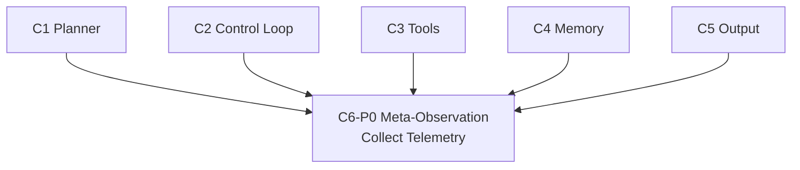
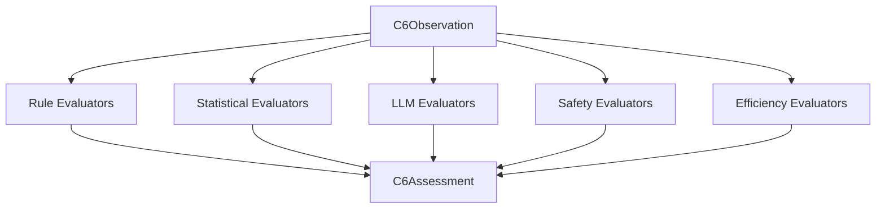
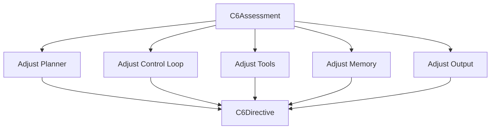

# Brain‑24 C6 — Meta‑Cognition Layer  
**Meta‑Observation → Meta‑Evaluation → Meta‑Adjustment**

C6 is the self‑reflection and self‑improvement layer of Brain‑24.  
It observes the entire C1–C5 pipeline, evaluates its performance, and issues directives that modify how the brain thinks on the next cycle.

C6 is the first layer that treats the whole brain as an object of computation.

---

## 1. Purpose of C6  
C6 answers the question:

> “How well did I think, and how should I think differently next time?”

It provides:

- Self‑observation (telemetry collection)  
- Self‑evaluation (quality assessment)  
- Self‑adjustment (heuristic updates)

C6 does not rewrite code.  
It adjusts parameters, weights, thresholds, and heuristics inside C1–C5.

---

## 2. C6 Architecture Overview  
C6 consists of three sub‑components:

### **C6‑P0 — Meta‑Observation**  
Collects structured telemetry from:

- C1 Planner  
- C2 Control Loop  
- C3 Tools  
- C4 Memory  
- C5 Output  



---

### **C6‑P1 — Meta‑Evaluation**  
Runs evaluators over the observation:

- rule‑based evaluators  
- statistical evaluators  
- LLM‑based evaluators  
- safety evaluators  
- efficiency evaluators  

Produces a C6Assessment summarizing issues and scores.



---

### **C6‑P2 — Meta‑Adjustment**  
Applies updates to the brain:

- planning depth  
- tool selection priors  
- memory retrieval weights  
- output style heuristics  
- control‑loop thresholds  

Produces a C6Directive.



---

## 3. C6 Data Model  
C6 uses three core data structures:

- C6Observation  
- C6Assessment  
- C6Directive  

```python

@dataclass
class C6Observation:
    plan_depth: int
    plan_dead_ends: int
    control_loop_latency_ms: float
    tool_success_rate: float
    memory_precision: float
    output_quality_score: float
    raw: dict

@dataclass
class C6Assessment:
    issues: list[str]
    scores: dict
    summary: str

@dataclass
class C6Directive:
    adjust_planning_depth: int | None
    adjust_tool_prior: dict | None
    adjust_memory_weights: dict | None
    adjust_output_style: dict | None
    notes: str

```


---

## 4. C6 Control Loop  
The C6 loop is:

1. Observe  
2. Evaluate  
3. Adjust  

This loop runs after each full C1→C5 cycle.

```python

class C6MetaCognition:
    def observe(self, brain_state) -> C6Observation:
        return C6Observation(
            plan_depth=brain_state.plan.depth,
            plan_dead_ends=brain_state.plan.dead_ends,
            control_loop_latency_ms=brain_state.c2.latency,
            tool_success_rate=brain_state.c3.tool_success_rate,
            memory_precision=brain_state.c4.memory_precision,
            output_quality_score=brain_state.c5.output_quality,
            raw=brain_state.dump(),
        )

    def evaluate(self, obs: C6Observation) -> C6Assessment:
        issues = []
        if obs.plan_dead_ends > 3:
            issues.append("planning_dead_ends_high")
        if obs.tool_success_rate < 0.7:
            issues.append("tool_selection_poor")
        if obs.memory_precision < 0.6:
            issues.append("memory_noise")
        summary = ", ".join(issues) if issues else "healthy"
        return C6Assessment(issues=issues, scores=obs.raw, summary=summary)

    def adjust(self, assessment: C6Assessment) -> C6Directive:
        directive = C6Directive(
            adjust_planning_depth=None,
            adjust_tool_prior=None,
            adjust_memory_weights=None,
            adjust_output_style=None,
            notes=assessment.summary,
        )

        if "planning_dead_ends_high" in assessment.issues:
            directive.adjust_planning_depth = +1
        if "tool_selection_poor" in assessment.issues:
            directive.adjust_tool_prior = {"fallback_bias": +0.2}
        if "memory_noise" in assessment.issues:
            directive.adjust_memory_weights = {"recency": +0.1}

        return directive
```


---

## 5. Integration with C1–C5

### **C1 (Planner)**  
C6 can adjust:

- depth  
- breadth  
- heuristic weights  
- decomposition strategy  

### **C2 (Control Loop)**  
C6 can adjust:

- oscillation dampening  
- retry logic  
- stability thresholds  

### **C3 (Tools)**  
C6 can adjust:

- tool priors  
- fallback strategies  
- error‑handling heuristics  

### **C4 (Memory)**  
C6 can adjust:

- recency vs semantic weighting  
- hallucination‑risk filters  
- retrieval precision thresholds  

### **C5 (Output)**  
C6 can adjust:

- verbosity  
- structure  
- safety heuristics  

---

## 6. Summary  
C6 is the self‑improving brain inside Brain‑24.  
It ensures that every cycle of thought is better than the last.
