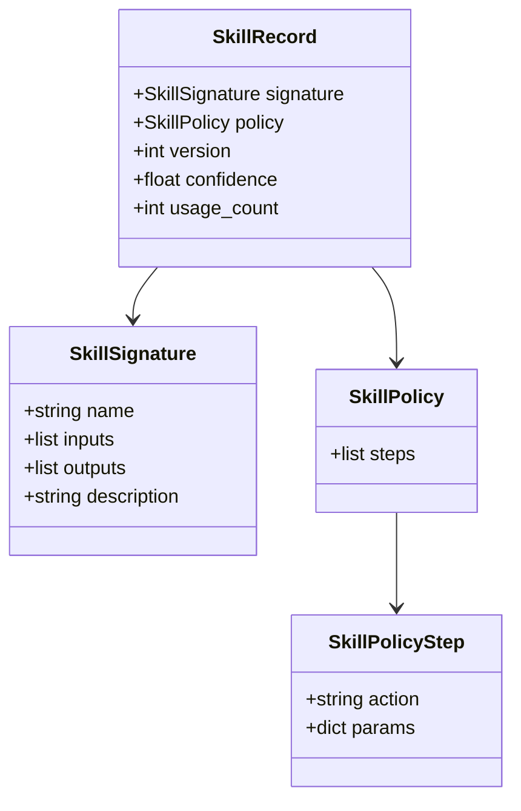
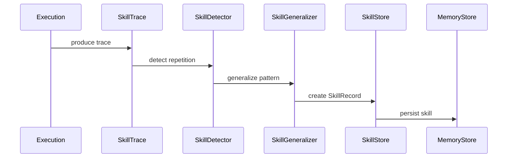
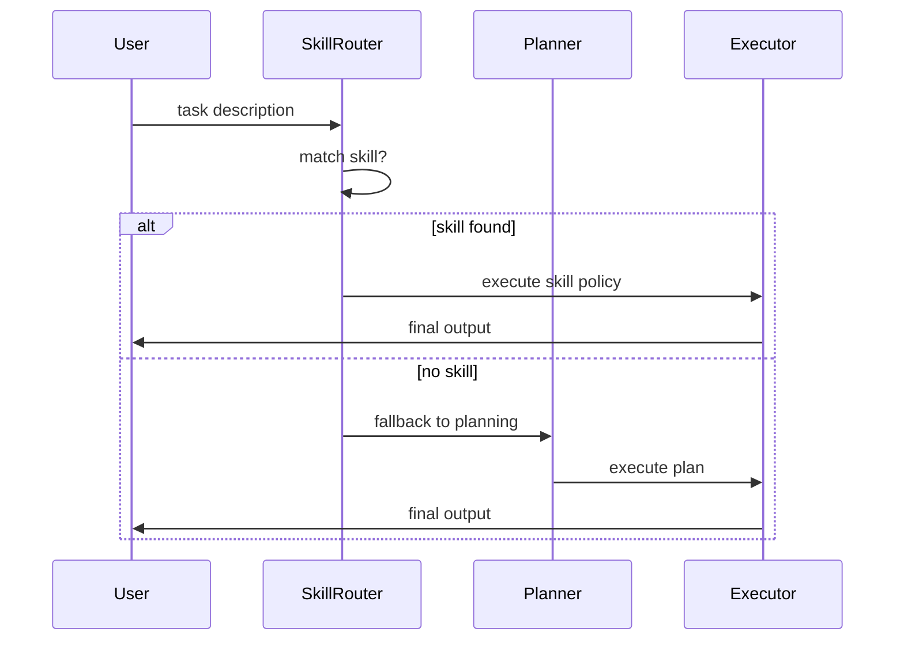
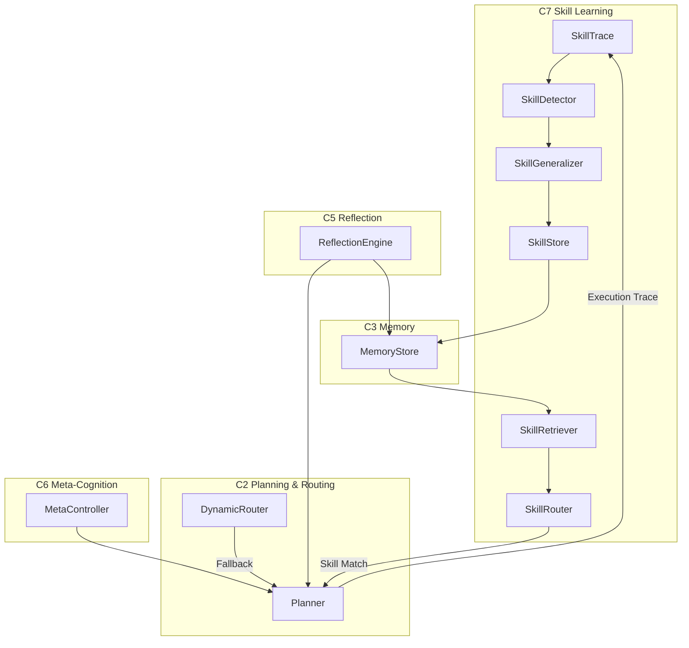

# Brain‑24 — Chapter 7 (Ch7)
# Skill Learning System (C7)
*Trace‑Induced Skill Acquisition for Whole‑Brain Agents*

---

## 7.1 Purpose
C7 introduces autonomous skill learning into Brain‑24.  
It enables the system to detect repeated multi‑step behaviors, generalize them into reusable skills, store them in long‑term memory, retrieve and execute them as shortcuts, reduce planning cost, and improve consistency and reliability.  
C7 is the first subsystem that gives Brain‑24 a self‑improving behavioral memory.

---

## 7.2 Position in the Brain‑24 Architecture
C7 sits between C2 (planning, routing, meta‑control), C3 (memory), C5 (reflection), and C6 (meta‑cognition).  
It is invoked before planning (skill routing) and after execution (skill learning).  
C7 does not replace C1–C6; it compresses their repeated outputs into reusable skills.

---

## 7.3 Core Concepts
**SkillTrace** captures a structured record of a multi‑step execution.  
**SkillDetector** identifies repeated action sequences across traces.  
**SkillGeneralizer** converts repeated traces into a reusable skill.  
**SkillStore** persists skills into C3 memory.  
**SkillRetriever** matches tasks to stored skills.  
**SkillRouter** executes skills before planning.

---

## 7.4 Skill Data Model
**SkillSignature** defines the identity and interface of a skill, including name, inputs, outputs, and description.  
**SkillPolicy** is a sequence of symbolic steps, each with an action and parameters.  
**SkillRecord** is the persisted skill, containing signature, policy, version, confidence, and usage count.

## Ch7 Data Model Diagram


---

## 7.5 Learning Pipeline
C7 learns skills from execution traces.  

**Trace Capture** converts the executed plan into a SkillTrace.  
**Pattern Detection** groups repeated action sequences.  
**Generalization** produces a SkillSignature and SkillPolicy.  
**Persistence** stores the skill in C3 memory.  

C7 only learns repeated patterns, ensuring stability and safety.



---

## 7.6 Routing Pipeline
Before planning, the orchestrator checks whether a matching skill exists.  
If yes, the skill is executed directly.  
If no, normal planning proceeds.  
Skill routing is deterministic and fast.



---

## 7.7 Integration with Orchestrator
C7 integrates at two points:  

**Pre‑planning:** SkillRouter attempts to match and execute a skill.  
**Post‑execution:** SkillLearner receives the execution trace.  

This ensures skills are used when available and learned when appropriate.



---

## 7.8 Memory Layout
Skills are stored under keys of the form:  

`skill::<name>::v<version>`  

This supports versioning, inspection, migration, and debugging.

```
skill::skill_email_task::v1
skill::skill_math_task::v1
skill::skill_shortcut_task::v1
```

---

## 7.9 Safety Properties
C7 is designed to be non‑disruptive: planning continues if no skill matches.  
It is deterministic: skill replay is stable.  
It is trace‑driven: only repeated patterns become skills.  
It is memory‑scoped: skills live in C3 memory.

---

## 7.10 Future Extensions
C7 is intentionally minimal.  
Future chapters will extend it with embedding‑based skill retrieval, multi‑version skill evolution, skill pruning, skill composition, and skill introspection.

---

## 7.11 Summary
C7 introduces autonomous skill learning to Brain‑24.  
It detects repeated behaviors, generalizes them into skills, stores them in memory, retrieves them for future tasks, bypasses planning, and improves over time.  
This is the foundation of a self‑improving agent.
