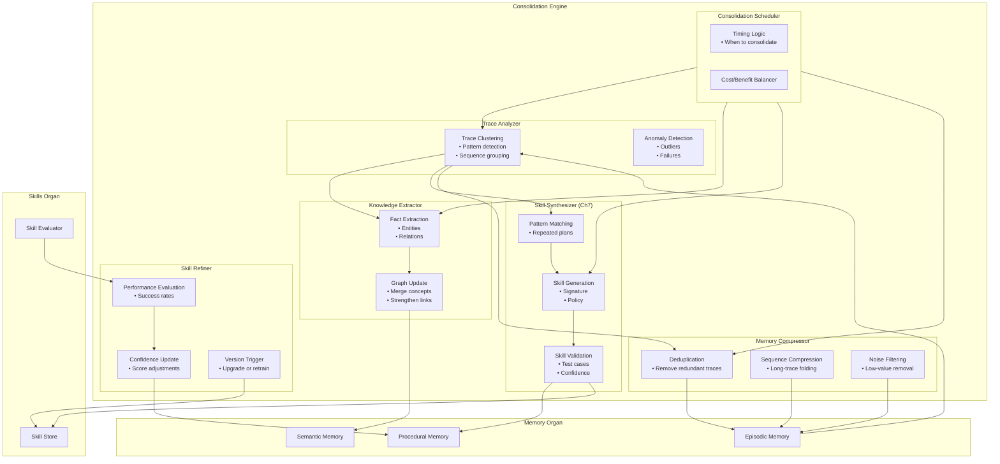

# Consolidation Engine — Zoomed‑In Subsystem Poster

This poster zooms into the **Consolidation Engine**, the subsystem responsible for transforming raw experience into structured long‑term knowledge.  
It sits inside the Memory Organ and interacts directly with C2 (Meta‑Cognition + Skill Learning) and the Skills Organ.

The Consolidation Engine is responsible for:
- Converting episodic traces into semantic knowledge  
- Converting repeated plan patterns into procedural skills (Ch7)  
- Cleaning, compressing, and maintaining memory health  
- Updating skill confidence and triggering refinement  
- Supporting reflective cognition (C5)  

---

## 1. Consolidation Engine Diagram

---

## 2. Responsibilities of the Consolidation Engine

### **Episodic → Semantic Consolidation**
- Extracts stable facts from episodic traces  
- Updates the semantic knowledge graph  
- Merges redundant or overlapping concepts  
- Strengthens frequently used knowledge  

### **Episodic → Procedural Consolidation (Ch7)**
- Detects repeated plan patterns  
- Generalizes reusable skills  
- Creates skill signatures and policies  
- Sends new skills to the Skills Organ  
- Updates procedural memory  

### **Memory Cleanup & Compression**
- Removes low‑value or redundant traces  
- Compresses long episodic sequences  
- Normalizes semantic clusters  
- Maintains memory health and efficiency  

### **Skill Refinement**
- Monitors skill performance  
- Adjusts confidence scores  
- Flags skills for retraining  
- Supports version upgrades  

### **Reflective Support (C5)**
- Provides structured summaries of experience  
- Supplies insights for reflective cognition  
- Supports strategy updates in C2  

---

## 3. Internal Components of the Consolidation Engine

### **1. Trace Analyzer**
- Clusters episodic traces  
- Detects patterns and anomalies  
- Identifies candidate skills  

### **2. Knowledge Extractor**
- Extracts facts, relations, and concepts  
- Updates semantic memory  
- Strengthens or weakens knowledge nodes  

### **3. Skill Synthesizer (Ch7)**
- Generalizes repeated plans  
- Builds skill signatures and policies  
- Validates skill candidates  

### **4. Memory Compressor**
- Deduplicates traces  
- Compresses long sequences  
- Removes noise and redundancy  

### **5. Skill Refiner**
- Evaluates skill performance  
- Adjusts confidence scores  
- Triggers version updates  

### **6. Consolidation Scheduler**
- Determines when consolidation runs  
- Balances cost vs. benefit  
- Supports background consolidation  

---

## 4. Consolidation Engine Interactions

### **With Episodic Memory**
- Reads raw traces  
- Writes cleaned and compressed traces  
- Extracts patterns for skill formation  

### **With Semantic Memory**
- Writes extracted knowledge  
- Updates concept clusters  
- Strengthens or weakens relations  

### **With Procedural Memory**
- Writes new skills  
- Updates skill metadata  
- Refines skill versions  

### **With Skills Organ**
- Sends new skills for storage  
- Receives performance metrics  
- Triggers skill refinement  

### **With C2**
- Provides candidate skills  
- Supplies semantic knowledge  
- Supports reflective updates  

---

## 5. Purpose of This Poster

This subsystem poster helps you:

- Understand the internal architecture of the Consolidation Engine  
- Visualise how Brain‑24 turns experience into knowledge and skills  
- Support incremental implementation of Ch7  
- Provide a subsystem‑level reference for engineering and testing  

---

## 6. Related Documents

- **Memory Organ Poster** — `brain-24-memory-organ-poster.md`  
- **Skills Organ Poster** — `brain-24-skills-organ-poster.md`  
- **C2 Subsystem Poster** — `brain-24-C2-subsystem-poster.md`  
- **Ch7 Skill Learning** — `docs/brain-24/Ch7/`  
- **Full Brain‑24 Poster** — `04-poster/brain-24-single-page-poster.md`
