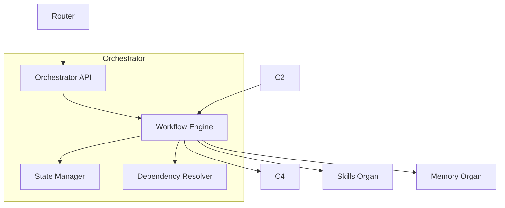

# Orchestrator — Control Plane Subsystem Poster

The Orchestrator manages **multi‑step cognitive workflows**.  
It coordinates C1, C2, C3, C4, Skills, and Memory.

Responsibilities:
- step scheduling  
- dependency management  
- tool + skill orchestration  
- state tracking  
- error recovery  

---

## 1. Orchestrator Diagram

---

## 2. Responsibilities

### **Workflow Scheduling**
- Manages multi‑step tasks  
- Coordinates across subsystems  

### **State Tracking**
- Tracks intermediate results  
- Maintains workflow context  

### **Skill + Tool Orchestration**
- Calls Skills Organ  
- Calls C4 for tools  

### **Error Recovery**
- Retries failed steps  
- Escalates to C2 or C5  

---

## 3. Internal Components

### **Workflow Engine**
- Executes multi‑step plans  

### **State Manager**
- Stores intermediate state  

### **Dependency Resolver**
- Orders steps  

### **Orchestrator API**
- Interface for C2 and Router  

---

## 4. Interactions

### **With Router**
- Receives tasks  

### **With C2**
- Executes plans  

### **With C4**
- Executes tool steps  

### **With Skills**
- Executes skill steps  

### **With Memory**
- Logs workflow traces  

---

## 5. Related Documents
- Router Poster  
- Control Plane Unified Poster  
