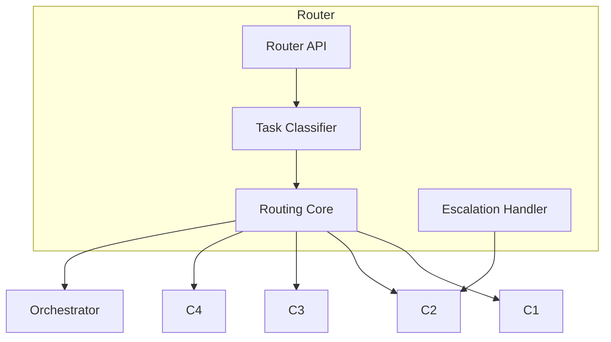

# Router — Control Plane Subsystem Poster

The Router is the entrypoint of the Control Plane.  
It decides **which cognitive subsystem** should handle a task.

Router responsibilities:
- task classification  
- routing to C1/C2/C3/C4  
- detecting escalations  
- maintaining system flow  

---

## 1. Router Diagram

---

## 2. Responsibilities

### **Task Classification**
- Detects complexity  
- Identifies required cognition  

### **Routing**
- Sends tasks to C1, C2, C3, or C4  

### **Escalation Handling**
- Receives escalations from C1/C4  
- Re‑routes to C2  

### **Flow Control**
- Maintains system throughput  
- Avoids overload  

---

## 3. Internal Components

### **Classifier**
- Determines task type  

### **Router Core**
- Chooses destination subsystem  

### **Escalation Handler**
- Handles escalations  

### **Router API**
- Entry point for all tasks  

---

## 4. Interactions

### **With C1/C2/C3/C4**
- Sends tasks  
- Receives escalations  

### **With Orchestrator**
- Provides routing decisions  

---

## 5. Related Documents
- Orchestrator Poster  
- Control Plane Unified Poster  
