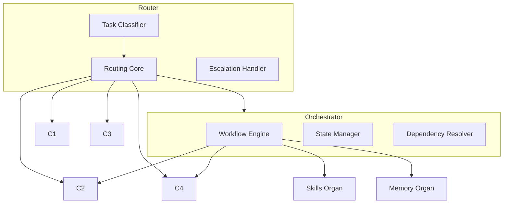

# Unified Control Plane — Router + Orchestrator  
Zoomed‑In Subsystem Poster

The Control Plane coordinates **all cognitive activity** in Brain‑24.  
It consists of:

- **Router** — decides *where* a task goes  
- **Orchestrator** — decides *how* a task unfolds over time  

Together, they form the execution backbone of the Cortex.

---

## 1. Unified Control Plane Diagram

---

## 2. Responsibilities

### **Router**
- Task classification  
- Routing to C1/C2/C3/C4  
- Escalation handling  

### **Orchestrator**
- Multi‑step workflow execution  
- State tracking  
- Skill + tool orchestration  
- Error recovery  

---

## 3. Interactions

### **Router → Orchestrator**
- Sends tasks requiring multi‑step execution  

### **Orchestrator → Cortex**
- Executes plans across C1–C5  

### **Control Plane → Memory**
- Logs traces  

### **Control Plane → Skills**
- Executes skill steps  

### **Control Plane → C4**
- Executes tool steps  

---

## 4. Related Documents
- Router Poster  
- Orchestrator Poster  
- C1/C2/C3/C4 Posters  
