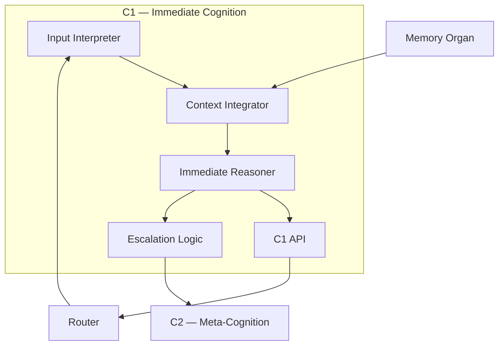

# C1 — Immediate Cognition  
Zoomed‑In Subsystem Poster

C1 is the lowest‑latency cognitive layer of Brain‑24.  
It handles fast, reactive, context‑bound reasoning — the “System‑1‑like” layer.

C1 is responsible for:
- rapid interpretation  
- immediate response generation  
- short‑context reasoning  
- grounding and disambiguation  
- low‑latency decision making  

---

## 1. C1 Diagram

---

## 2. Responsibilities of C1

### **Fast Interpretation**
- Parses user input  
- Extracts intent and constraints  
- Performs grounding and disambiguation  

### **Immediate Reasoning**
- Executes short‑horizon reasoning  
- Handles simple tasks without planning  
- Provides fast fallback responses  

### **Context Integration**
- Reads recent episodic traces  
- Uses semantic knowledge for grounding  
- Maintains short‑term working context  

### **Low‑Latency Decision Making**
- Chooses immediate actions  
- Routes tasks to C2 when complexity increases  
- Handles reactive tasks  

---

## 3. Internal Components

### **1. Input Interpreter**
- Parses text  
- Extracts entities and intent  

### **2. Context Integrator**
- Reads short‑term memory  
- Applies semantic grounding  

### **3. Immediate Reasoner**
- Performs fast reasoning  
- Handles simple tasks directly  

### **4. Escalation Logic**
- Detects when C2 is needed  
- Routes complex tasks upward  

### **5. C1 API**
- Provides immediate responses  
- Sends escalations to C2  
- Reads from Memory Organ  

---

## 4. Interactions

### **With C2**
- Escalates complex tasks  
- Provides grounded context  

### **With Memory**
- Reads semantic knowledge  
- Reads recent episodic traces  

### **With Router**
- Receives tasks  
- Sends escalations  

---

## 5. Related Documents
- C2 Subsystem Poster  
- Memory Organ Posters  
- Control Plane Posters  
