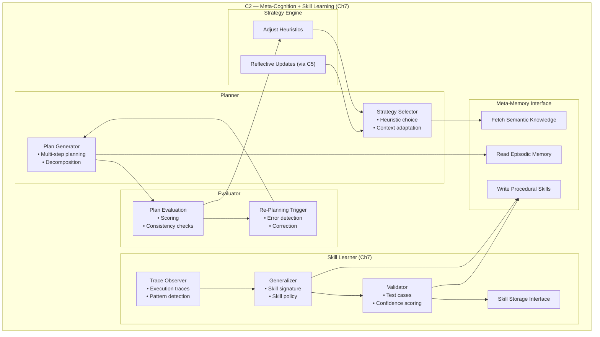

# C2 Subsystem Poster — Meta‑Cognition + Skill Learning (Ch7)

This poster zooms into the internal structure of **C2**, the meta‑cognitive subsystem of Brain‑24.  
C2 is responsible for planning, evaluation, decomposition, meta‑control, and skill learning (Ch7).  
It sits at the heart of the Cortex and coordinates with Memory, Skills, and the Control Plane.

---

## 1. C2 Subsystem Diagram

---

## 2. C2 Responsibilities

### **Core Meta‑Cognition**
- Multi‑step planning  
- Task decomposition  
- Strategy selection  
- Evaluation of plan quality  
- Triggering re‑planning  
- Monitoring execution traces  

### **Skill Learning (Ch7)**
- Detecting repeated plan patterns  
- Generalizing reusable skills  
- Creating skill signatures and policies  
- Validating learned skills  
- Storing skills in the Skills Organ  
- Retrieving skills for future planning  

### **Meta‑Control**
- Deciding when to intervene  
- Deciding when to escalate to C3  
- Deciding when to call tools (via C4)  
- Deciding when to reflect (via C5)  

---

## 3. C2 Internal Components

### **1. Planner**
- Generates multi‑step plans  
- Chooses between skills and primitive actions  
- Uses Memory for context and prior knowledge  

### **2. Evaluator**
- Scores plan quality  
- Detects inconsistencies  
- Triggers re‑planning or correction  

### **3. Skill Learner (Ch7)**
- Observes plan traces  
- Clusters similar tasks  
- Generalizes new skills  
- Stores and versions skills  

### **4. Meta‑Memory Interface**
- Reads episodic traces  
- Writes procedural skill records  
- Retrieves relevant past experiences  

### **5. Strategy Engine**
- Chooses planning strategies  
- Adjusts heuristics based on context  
- Coordinates with C5 for reflective updates  

---

## 4. C2 Interactions

### **With Memory**
- Reads episodic traces  
- Writes procedural skills  
- Retrieves semantic knowledge  

### **With Skills Organ**
- Stores new skills  
- Retrieves learned skills  
- Updates skill versions  

### **With C3**
- Escalates complex or long‑horizon tasks  
- Receives self‑directed goals  

### **With C4**
- Delegates tool‑based actions  
- Receives tool capabilities  

### **With C5**
- Receives reflective corrections  
- Updates planning strategies  

---

## 5. Purpose of This Poster

This subsystem poster helps you:

- Understand the internal architecture of C2  
- Visualise how meta‑cognition and skill learning integrate  
- Support incremental implementation of Ch7  
- Provide a subsystem‑level reference for engineering and testing  

---

## 6. Related Documents

- **Ch7 Skill Learning** — `docs/brain-24/Ch7/`  
- **C2 Evolution (P0 → P1 → P2)** — `brain-24-C2-P0-P1-P2-evolution.md`  
- **C2 Type System** — `brain-24-C2-type-system.md`  
- **C2 Director** — `brain-24-C2-director.md`  
- **Full Brain‑24 Poster** — `04-poster/brain-24-single-page-poster.md`
