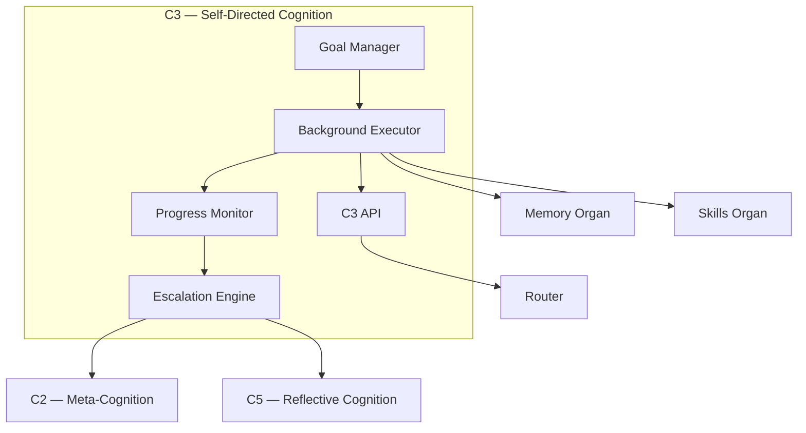

# C3 — Self‑Directed Cognition  
Zoomed‑In Subsystem Poster

C3 is the autonomous, long‑horizon cognition layer.  
It manages background tasks, self‑initiated goals, and multi‑step self‑directed workflows.

C3 is responsible for:
- autonomous task initiation  
- long‑horizon goal pursuit  
- background reasoning  
- monitoring and maintaining internal tasks  
- interacting with Memory and Skills  

---

## 1. C3 Diagram

---

## 2. Responsibilities of C3

### **Autonomous Goal Management**
- Creates self‑directed tasks  
- Maintains long‑term goals  
- Monitors progress  

### **Background Reasoning**
- Runs tasks asynchronously  
- Performs slow, reflective analysis  
- Uses Memory and Skills  

### **Task Scheduling**
- Prioritizes background tasks  
- Coordinates with Router  
- Avoids interference with C1/C2  

### **Self‑Monitoring**
- Detects stalled tasks  
- Requests help from C2 or C5  
- Maintains task health  

---

## 3. Internal Components

### **1. Goal Manager**
- Stores long‑term goals  
- Tracks dependencies  

### **2. Background Executor**
- Runs tasks asynchronously  
- Uses Skills and Memory  

### **3. Progress Monitor**
- Detects failures  
- Reports status  

### **4. Escalation Engine**
- Escalates to C2 or C5  
- Requests refinement  

### **5. C3 API**
- Schedules tasks  
- Reports progress  
- Integrates with Router  

---

## 4. Interactions

### **With C2**
- Requests planning help  
- Receives refined strategies  

### **With C5**
- Receives reflective insights  
- Sends stalled tasks  

### **With Memory**
- Reads semantic knowledge  
- Writes episodic traces  

### **With Skills**
- Executes skills autonomously  

---

## 5. Related Documents
- C2 Poster  
- C5 Poster  
- Skills Organ Poster  
- Memory Organ Posters  
