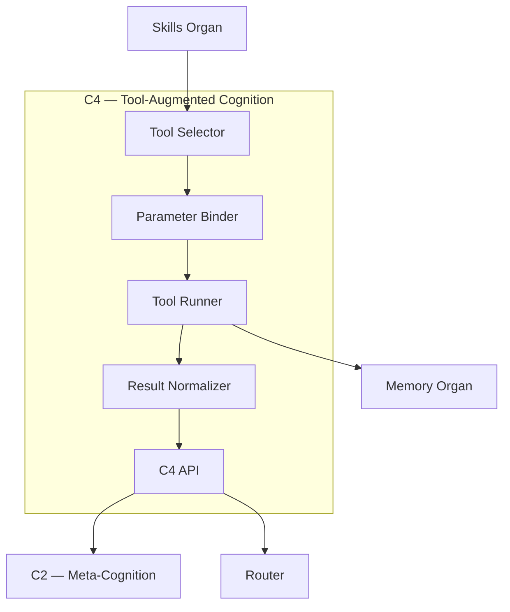

# C4 — Tool‑Augmented Cognition  
Zoomed‑In Subsystem Poster

C4 is the subsystem that integrates external tools, APIs, and environments into Brain‑24’s cognition.

C4 is responsible for:
- tool selection  
- tool execution  
- parameter binding  
- error handling  
- integrating tool results into cognition  

---

## 1. C4 Diagram

---

## 2. Responsibilities of C4

### **Tool Selection**
- Chooses tools based on context  
- Uses semantic and procedural memory  

### **Parameter Binding**
- Validates inputs  
- Converts parameters  
- Ensures type safety  

### **Tool Execution**
- Executes external tools  
- Handles multi‑step tool workflows  

### **Result Integration**
- Normalizes tool outputs  
- Sends results to C1/C2/C3  
- Stores traces in Episodic Memory  

### **Error Handling**
- Detects tool failures  
- Retries or escalates  

---

## 3. Internal Components

### **1. Tool Selector**
- Chooses best tool  
- Uses skill metadata  

### **2. Parameter Binder**
- Validates and binds inputs  

### **3. Tool Runner**
- Executes tools  
- Handles multi‑step workflows  

### **4. Result Normalizer**
- Cleans and structures outputs  

### **5. C4 API**
- Provides tool execution interface  
- Integrates with Router and C2  

---

## 4. Interactions

### **With Skills**
- Executes tool‑based skill steps  

### **With C2**
- Provides tool results  
- Receives tool selection hints  

### **With Memory**
- Logs tool traces  

### **With Router**
- Receives tool tasks  

---

## 5. Related Documents
- Skills Organ Poster  
- C2 Poster  
- Memory Organ Posters  
