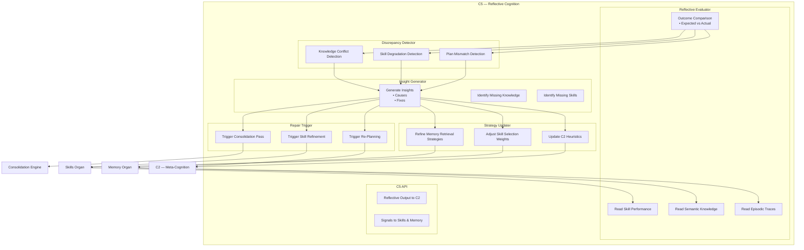

# C5 — Reflective Cognition  
Zoomed‑In Subsystem Poster

This poster zooms into **C5**, the Reflective Cognition subsystem of Brain‑24.  
C5 is responsible for evaluating outcomes, detecting inconsistencies, updating strategies, and triggering corrective actions.  
It is the “self‑monitoring” and “self‑improving” layer of the Cortex.

C5 sits above C2, Skills, Memory, and Consolidation — reading their outputs and shaping future cognition.

---

## 1. C5 Diagram

---

## 2. Responsibilities of C5

### **Outcome Evaluation**
- Analyzes execution traces  
- Compares expected vs. actual results  
- Detects anomalies and inconsistencies  

### **Self‑Correction**
- Identifies flawed plans  
- Flags degraded skills  
- Suggests alternative strategies  

### **Strategy Updating**
- Adjusts planning heuristics in C2  
- Updates skill selection preferences  
- Refines retrieval strategies in Memory  

### **Reflection‑Driven Learning**
- Triggers consolidation when needed  
- Suggests skill refinement or regeneration  
- Strengthens or weakens semantic knowledge  

### **Meta‑Control**
- Decides when to re‑plan  
- Decides when to escalate to C3  
- Decides when to refine skills or memory  

---

## 3. Internal Components of C5

### **1. Reflective Evaluator**
- Reads episodic traces  
- Reads semantic knowledge  
- Reads skill performance metrics  
- Computes reflective insights  

### **2. Discrepancy Detector**
- Detects mismatches between plan and outcome  
- Identifies hallucinations or reasoning errors  
- Flags degraded skills or faulty knowledge  

### **3. Insight Generator**
- Produces reflective insights  
- Suggests strategy changes  
- Identifies missing knowledge or skills  

### **4. Strategy Updater**
- Updates C2 heuristics  
- Adjusts skill selection weights  
- Refines memory retrieval strategies  

### **5. Repair Trigger**
- Triggers re‑planning  
- Triggers skill refinement  
- Triggers consolidation passes  

### **6. C5 API**
- Provides reflective outputs to C2  
- Sends refinement signals to Skills and Memory  
- Integrates with Consolidation Engine  

---

## 4. C5 Interactions

### **With C2 (Meta‑Cognition)**
- Provides reflective insights  
- Updates planning heuristics  
- Triggers re‑planning  

### **With Skills Organ**
- Flags degraded skills  
- Suggests refinement or regeneration  
- Updates skill selection weights  

### **With Memory Organ**
- Flags inconsistent knowledge  
- Suggests semantic updates  
- Requests episodic traces for deeper analysis  

### **With Consolidation Engine**
- Triggers consolidation passes  
- Sends refinement requests  
- Receives updated knowledge and skills  

---

## 5. Purpose of This Poster

This subsystem poster helps you:

- Understand the internal architecture of C5  
- Visualise how reflection drives self‑correction and improvement  
- Support incremental implementation of reflective cognition  
- Provide a subsystem‑level reference for engineering and testing  

---

## 6. Related Documents

- **C2 Subsystem Poster** — `brain-24-C2-subsystem-poster.md`  
- **Skills Organ Poster** — `brain-24-skills-organ-poster.md`  
- **Memory Organ Posters** — Episodic, Semantic, Procedural  
- **Consolidation Engine Poster** — `brain-24-consolidation-engine-poster.md`  
- **Learning Stack Poster** — `brain-24-learning-stack.md`  
- **Ch7 Skill Learning** — `docs/brain-24/Ch7/`
