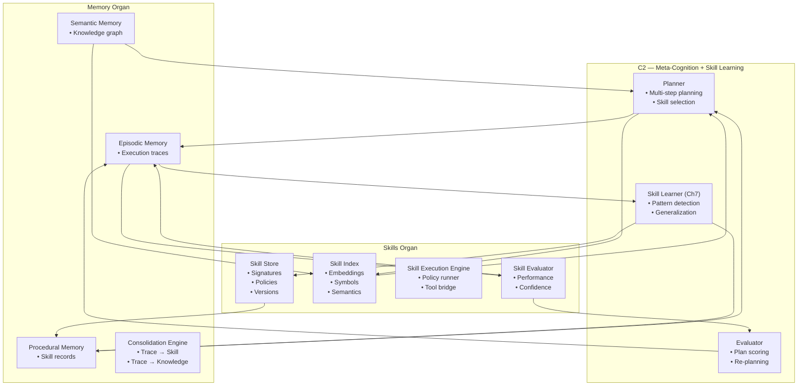

# Cross‑Organ Interaction Poster — C2 ↔ Skills ↔ Memory

This poster shows the interaction loop between **C2 (Meta‑Cognition + Skill Learning)**, the **Skills Organ**, and the **Memory Organ**.  
Together, these three subsystems form the core of Brain‑24’s learning architecture: planning, skill formation, storage, retrieval, and refinement.

---

## 1. Cross‑Organ Interaction Diagram

---

## 2. Overview of the Learning Loop

The interaction between C2, Skills, and Memory forms a continuous cycle:

1. **C2 plans and executes tasks**  
2. **C2 observes execution traces** (from Memory)  
3. **C2 generalizes repeated patterns into skills**  
4. **Skills Organ stores and versions these skills**  
5. **Memory stores procedural skill records**  
6. **C2 retrieves skills for future planning**  
7. **Skills Organ evaluates skill performance**  
8. **Memory stores episodic traces for refinement**

This loop enables Brain‑24 to become more efficient, more autonomous, and more capable over time.

---

## 3. Responsibilities of Each Subsystem

### **C2 — Meta‑Cognition + Skill Learning**
- Generates multi‑step plans  
- Detects repeated patterns  
- Generalizes new skills (Ch7)  
- Evaluates plan quality  
- Retrieves skills for planning  
- Writes procedural knowledge to Memory  

### **Skills Organ**
- Stores learned skills  
- Maintains signatures, policies, versions  
- Provides skills to C2 during planning  
- Executes skill policies  
- Evaluates skill performance  
- Updates confidence scores  

### **Memory Organ**
- Stores episodic traces  
- Stores semantic knowledge  
- Stores procedural skill records  
- Provides retrieval for C2 and Skills  
- Supports consolidation and refinement  

---

## 4. Interaction Patterns

### **1. C2 → Memory**
- Writes episodic traces  
- Writes procedural skill records  
- Reads semantic knowledge  

### **2. C2 → Skills**
- Sends new skills for storage  
- Requests skills for planning  
- Updates skill versions  

### **3. Skills → Memory**
- Stores procedural skill metadata  
- Retrieves episodic traces for evaluation  
- Uses semantic knowledge for indexing  

### **4. Memory → C2**
- Provides episodic traces for learning  
- Provides semantic knowledge for planning  
- Provides procedural skills for reuse  

### **5. Skills → C2**
- Returns skill candidates  
- Provides execution results  
- Supplies confidence scores  

---

## 5. Purpose of This Poster

This poster helps you:

- Understand the core learning architecture of Brain‑24  
- Visualise how skills are formed, stored, retrieved, and refined  
- Support incremental implementation of Ch7  
- Provide a subsystem‑level reference for engineering and testing  

---

## 6. Related Documents

- **C2 Subsystem Poster** — `brain-24-C2-subsystem-poster.md`  
- **Skills Organ Poster** — `brain-24-skills-organ-poster.md`  
- **Memory Organ Poster** — `brain-24-memory-organ-poster.md`  
- **Ch7 Skill Learning** — `docs/brain-24/Ch7/`  
- **Full Brain‑24 Poster** — `04-poster/brain-24-single-page-poster.md`
