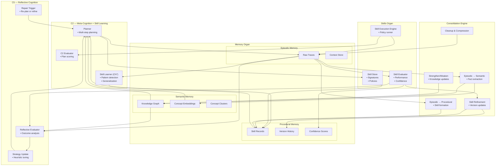

# Brain‑24 Learning Stack — Unified Cross‑Organ Poster  
(C2 ↔ Skills ↔ Memory ↔ Consolidation ↔ C5)

This poster shows the **full adaptive learning stack** of Brain‑24 — the continuous loop that allows the system to learn from experience, generalize knowledge, form skills, refine skills, and reflect on its own performance.

The Learning Stack integrates five major subsystems:

- **C2 — Meta‑Cognition + Skill Learning (Ch7)**
- **Skills Organ**
- **Memory Organ (Episodic, Semantic, Procedural)**
- **Consolidation Engine**
- **C5 — Reflective Cognition**

Together, these systems form the **self‑improving core** of Brain‑24.

---

## 1. Learning Stack Diagram

---

## 2. Overview of the Learning Stack

The Learning Stack operates as a continuous cycle:

1. **C2 plans and executes tasks**  
2. **Episodic Memory captures experience**  
3. **Consolidation transforms experience into knowledge and skills**  
4. **Semantic Memory stores structured knowledge**  
5. **Procedural Memory stores learned skills**  
6. **Skills Organ retrieves and executes skills**  
7. **Skill Evaluation updates confidence and performance**  
8. **C5 reflects on outcomes and updates strategies**  
9. **C2 uses refined skills and knowledge for better planning**

This loop enables Brain‑24 to:
- learn from experience  
- generalize concepts  
- build reusable skills  
- refine skills over time  
- maintain coherent long‑term memory  
- improve planning and reasoning  
- self‑correct and self‑improve  

---

## 3. Responsibilities of Each Layer

### **C2 — Meta‑Cognition + Skill Learning**
- Multi‑step planning  
- Pattern detection  
- Skill generalization (Ch7)  
- Plan evaluation  
- Retrieval of skills and knowledge  

### **Skills Organ**
- Stores and retrieves skills  
- Executes skill policies  
- Tracks versions and confidence  
- Evaluates skill performance  

### **Memory Organ**
- **Episodic:** raw traces  
- **Semantic:** structured knowledge  
- **Procedural:** skill records  

### **Consolidation Engine**
- Converts traces → knowledge  
- Converts patterns → skills  
- Cleans and compresses episodic memory  
- Updates semantic clusters  
- Refines procedural skills  

### **C5 — Reflective Cognition**
- Evaluates outcomes  
- Detects inconsistencies  
- Updates strategies and heuristics  
- Triggers re‑planning or refinement  

---

## 4. Cross‑Organ Interaction Patterns

### **C2 ↔ Memory**
- Writes episodic traces  
- Reads semantic knowledge  
- Retrieves procedural skills  

### **C2 ↔ Skills**
- Requests skills for planning  
- Sends new skills for storage  

### **Skills ↔ Memory**
- Stores skill records  
- Retrieves embeddings and concepts  
- Logs execution traces  

### **Skills ↔ Consolidation**
- Sends performance metrics  
- Receives refined skill versions  

### **Memory ↔ Consolidation**
- Episodic → Semantic  
- Episodic → Procedural  
- Semantic updates  
- Procedural refinement  

### **C5 ↔ Everything**
- Reads episodic traces  
- Reads semantic knowledge  
- Evaluates skill performance  
- Updates C2 strategies  
- Triggers consolidation  

---

## 5. Purpose of This Poster

This poster helps you:

- Understand the full adaptive learning architecture of Brain‑24  
- Visualise how cognition, memory, skills, consolidation, and reflection interact  
- Support incremental implementation of Ch7 and C5  
- Provide a subsystem‑level reference for engineering and testing  

---

## 6. Related Documents

- **C2 Subsystem Poster** — `brain-24-C2-subsystem-poster.md`  
- **Skills Organ Poster** — `brain-24-skills-organ-poster.md`  
- **Memory Organ Posters** — Episodic, Semantic, Procedural  
- **Consolidation Engine Poster** — `brain-24-consolidation-engine-poster.md`  
- **C5 Reflective Cognition Poster** — `brain-24-C5-reflection-poster.md`  
- **Cross‑Organ Posters** — Memory ↔ Skills ↔ C2 ↔ Consolidation  
- **Ch7 Skill Learning** — `docs/brain-24/Ch7/`
