# Cross‑Organ Interaction Poster — Memory ↔ Skills ↔ C2 ↔ Consolidation

This poster shows the full learning loop of Brain‑24, integrating four major subsystems:

- **C2 — Meta‑Cognition + Skill Learning (Ch7)**
- **Skills Organ**
- **Memory Organ (Episodic, Semantic, Procedural)**
- **Consolidation Engine**

Together, these systems form the adaptive core of Brain‑24 — the mechanism by which the system learns from experience, generalizes knowledge, forms skills, refines skills, and improves over time.

---

## 1. Cross‑Organ Interaction Diagram

```mermaid
flowchart TB

    %% ============================
    %% C2 — META-COGNITION
    %% ============================
    subgraph C2["C2 — Meta‑Cognition + Skill Learning"]
        Planner["Planner\n• Multi-step planning"]
        SkillLearner["Skill Learner (Ch7)\n• Pattern detection\n• Generalization"]
        Evaluator["Evaluator\n• Plan scoring"]
    end

    %% ============================
    %% SKILLS ORGAN
    %% ============================
    subgraph Skills["Skills Organ"]
        SkillStore["Skill Store\n• Signatures\n• Policies"]
        SkillExec["Skill Execution Engine\n• Policy runner"]
        SkillEval["Skill Evaluator\n• Performance\n• Confidence"]
    end

    %% ============================
    %% MEMORY ORGAN
    %% ============================
    subgraph Memory["Memory Organ"]

        subgraph Episodic["Episodic Memory"]
            RawTraces["Raw Traces"]
            Context["Context Store"]
        end

        subgraph Semantic["Semantic Memory"]
            KG["Knowledge Graph"]
            Embeddings["Concept Embeddings"]
            Clusters["Concept Clusters"]
        end

        subgraph Procedural["Procedural Memory"]
            SkillRecords["Skill Records"]
            Versions["Version History"]
            Confidence["Confidence Scores"]
        end

    end

    %% ============================
    %% CONSOLIDATION ENGINE
    %% ============================
    subgraph Consolidation["Consolidation Engine"]
        E2S["Episodic → Semantic\n• Fact extraction"]
        E2P["Episodic → Procedural\n• Skill formation"]
        Cleanup["Cleanup & Compression"]
        Strengthen["Strengthen/Weaken\n• Knowledge updates"]
        Refine["Skill Refinement\n• Version updates"]
    end

    %% ============================
    %% INTERACTIONS
    %% ============================

    %% C2 ↔ Episodic
    Planner --> RawTraces
    RawTraces --> SkillLearner

    %% C2 ↔ Semantic
    KG --> Planner
    Embeddings --> Planner

    %% C2 ↔ Procedural
    SkillRecords --> Planner
    SkillLearner --> SkillRecords

    %% C2 ↔ Skills
    Planner --> SkillStore
    SkillExec --> Evaluator

    %% Skills ↔ Procedural
    SkillStore --> SkillRecords
    SkillEval --> Confidence

    %% Skills ↔ Episodic
    SkillExec --> RawTraces
    RawTraces --> SkillEval

    %% Skills ↔ Consolidation
    SkillEval --> Refine
    Refine --> SkillRecords

    %% Episodic ↔ Consolidation
    RawTraces --> E2S
    RawTraces --> E2P
    Cleanup --> RawTraces

    %% Semantic ↔ Consolidation
    E2S --> KG
    E2S --> Embeddings
    Strengthen --> KG

    %% Procedural ↔ Consolidation
    E2P --> SkillRecords
    Refine --> Versions
```

---

## 2. Overview of the Full Learning Loop

The learning loop operates continuously:

1. **C2 plans and executes tasks**  
2. **Episodic Memory records traces**  
3. **Consolidation extracts knowledge and skills**  
4. **Semantic Memory stores structured knowledge**  
5. **Procedural Memory stores learned skills**  
6. **Skills Organ retrieves and executes skills**  
7. **Skill Evaluation updates confidence and performance**  
8. **C2 uses skills and knowledge for future planning**

This loop enables Brain‑24 to:
- learn from experience  
- generalize concepts  
- build reusable skills  
- refine skills over time  
- maintain coherent long‑term memory  
- improve planning and reasoning  

---

## 3. Responsibilities of Each Subsystem

### **C2 — Meta‑Cognition + Skill Learning**
- Generates multi‑step plans  
- Detects repeated patterns  
- Generalizes new skills (Ch7)  
- Evaluates plan quality  
- Retrieves skills and knowledge  
- Writes procedural knowledge  

### **Skills Organ**
- Stores learned skills  
- Executes skill policies  
- Maintains versions and confidence  
- Evaluates skill performance  
- Provides skills to C2  

### **Memory Organ**
- **Episodic:** stores raw traces  
- **Semantic:** stores structured knowledge  
- **Procedural:** stores skill records  

### **Consolidation Engine**
- Converts episodic traces → semantic knowledge  
- Converts repeated patterns → procedural skills  
- Cleans and compresses episodic memory  
- Updates semantic clusters  
- Refines procedural skills  

---

## 4. Cross‑Organ Interaction Patterns

### **C2 ↔ Episodic Memory**
- C2 writes execution traces  
- Episodic Memory provides traces for learning  

### **C2 ↔ Semantic Memory**
- C2 retrieves knowledge for planning  
- Semantic Memory provides grounding  

### **C2 ↔ Procedural Memory**
- C2 retrieves skills  
- C2 updates skill versions  

### **C2 ↔ Skills Organ**
- C2 requests skills for planning  
- Skills Organ executes skills  

### **Skills Organ ↔ Procedural Memory**
- Skills Organ stores and retrieves skills  
- Procedural Memory tracks versions and confidence  

### **Skills Organ ↔ Episodic Memory**
- Skills generate new traces  
- Traces support skill evaluation  

### **Skills Organ ↔ Consolidation**
- Consolidation refines skills  
- Skills Organ provides performance metrics  

### **Consolidation ↔ Episodic Memory**
- Reads raw traces  
- Writes cleaned traces  

### **Consolidation ↔ Semantic Memory**
- Writes extracted knowledge  
- Updates concept clusters  

### **Consolidation ↔ Procedural Memory**
- Writes new skills  
- Refines existing skills  

---

## 5. Purpose of This Poster

This subsystem poster helps you:

- Understand the full learning architecture of Brain‑24  
- Visualise how cognition, memory, skills, and consolidation interact  
- Support incremental implementation of Ch7 and the Memory Organ  
- Provide a subsystem‑level reference for engineering and testing  

---

## 6. Related Documents

- **C2 Subsystem Poster** — `brain-24-C2-subsystem-poster.md`  
- **Skills Organ Poster** — `brain-24-skills-organ-poster.md`  
- **Memory Organ Posters** — Episodic, Semantic, Procedural  
- **Consolidation Engine Poster** — `brain-24-consolidation-engine-poster.md`  
- **Cross‑Memory Poster** — `brain-24-cross-memory-poster.md`  
- **Ch7 Skill Learning** — `docs/brain-24/Ch7/`
