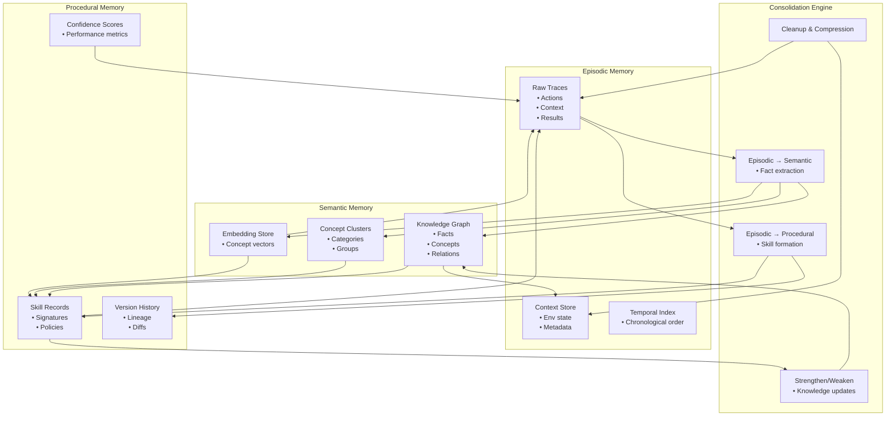

# Cross‑Memory Interaction Poster — Episodic ↔ Semantic ↔ Procedural

This poster shows the interaction loop between the three memory subsystems inside the Memory Organ:

- **Episodic Memory** — raw experience  
- **Semantic Memory** — structured knowledge  
- **Procedural Memory** — learned skills  

Together, these three systems form the **memory triad** that enables Brain‑24 to learn from experience, generalize knowledge, and evolve skills over time.

---

## 1. Cross‑Memory Interaction Diagram

---

## 2. Overview of the Memory Triad

The three memory systems interact in a continuous cycle:

1. **Episodic Memory captures raw experience**  
2. **Semantic Memory extracts stable knowledge**  
3. **Procedural Memory stores learned skills**  
4. **Skills generate new episodic traces**  
5. **Semantic Memory grounds episodic traces**  
6. **Procedural Memory uses semantic knowledge for indexing**  
7. **Consolidation Engine transforms traces → knowledge → skills**

This loop enables Brain‑24 to:
- learn from experience  
- generalize concepts  
- build reusable skills  
- refine skills over time  
- maintain coherent long‑term memory  

---

## 3. Responsibilities of Each Memory Subsystem

### **Episodic Memory**
- Stores chronological traces  
- Captures actions, context, results  
- Provides raw material for consolidation  
- Supports reflection and debugging  

### **Semantic Memory**
- Stores facts, concepts, relations  
- Maintains embeddings and clusters  
- Provides grounding for reasoning  
- Supports concept‑aware retrieval  

### **Procedural Memory**
- Stores skill signatures and policies  
- Tracks versions and confidence  
- Logs usage and performance  
- Supports skill retrieval and refinement  

---

## 4. Interaction Patterns

### **Episodic → Semantic**
- Extract facts and relations  
- Update concept clusters  
- Strengthen or weaken knowledge  

### **Semantic → Episodic**
- Provide grounding for trace interpretation  
- Support context‑aware retrieval  

### **Episodic → Procedural**
- Provide repeated patterns for skill formation  
- Supply execution traces for refinement  

### **Procedural → Episodic**
- Generate new traces during skill execution  
- Log success/failure and context  

### **Semantic → Procedural**
- Provide embeddings for skill indexing  
- Support concept‑aware skill retrieval  

### **Procedural → Semantic**
- Update semantic clusters with skill metadata  
- Strengthen concept relations used by skills  

---

## 5. Role of the Consolidation Engine

The Consolidation Engine orchestrates the triad:

- Converts episodic traces → semantic knowledge  
- Converts repeated patterns → procedural skills  
- Cleans and compresses episodic memory  
- Updates semantic clusters  
- Refines procedural skills  

It is the “bridge” between all three memory systems.

---

## 6. Purpose of This Poster

This subsystem poster helps you:

- Understand the internal dynamics of the Memory Organ  
- Visualise how experience becomes knowledge and skills  
- Support incremental implementation of the memory triad  
- Provide a subsystem‑level reference for engineering and testing  

---

## 7. Related Documents

- **Episodic Memory Poster** — `brain-24-episodic-memory-poster.md`  
- **Semantic Memory Poster** — `brain-24-semantic-memory-poster.md`  
- **Procedural Memory Poster** — `brain-24-procedural-memory-poster.md`  
- **Consolidation Engine Poster** — `brain-24-consolidation-engine-poster.md`  
- **Ch7 Skill Learning** — `docs/brain-24/Ch7/`
