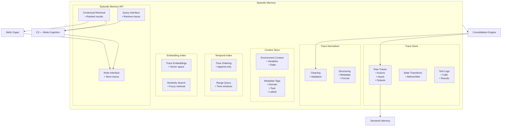

# Episodic Memory — Zoomed‑In Subsystem Poster

This poster zooms into **Episodic Memory**, the subsystem responsible for storing chronological traces of experience inside the Memory Organ.  
Episodic Memory captures the “what actually happened” of Brain‑24’s cognition and execution.

Episodic Memory is the backbone of:
- experience replay  
- skill learning (Ch7)  
- reflection (C5)  
- debugging and traceability  
- consolidation into semantic and procedural memory  

---

## 1. Episodic Memory Diagram

---

## 2. Responsibilities of Episodic Memory

### **Experience Capture**
- Records actions, inputs, outputs, and context  
- Stores state transitions  
- Logs tool calls and results  
- Captures failures and anomalies  

### **Chronological Storage**
- Maintains strict temporal ordering  
- Supports time‑based retrieval  
- Stores long‑horizon task traces  

### **Contextual Retrieval**
- Retrieves traces by similarity  
- Supports context‑aware search  
- Provides material for reflection and learning  

### **Trace Structuring**
- Normalizes trace format  
- Stores metadata (timestamps, tags, domains)  
- Supports multi‑level granularity  

### **Support for Consolidation**
- Provides raw material for semantic extraction  
- Supplies repeated patterns for skill formation  
- Supports compression and cleanup  

---

## 3. Internal Components of Episodic Memory

### **1. Trace Store**
- Stores raw episodic traces  
- Maintains strict chronological order  
- Supports append‑only writes  

### **2. Context Store**
- Stores contextual metadata  
- Tracks environment state  
- Supports context‑aware retrieval  

### **3. Temporal Index**
- Time‑based indexing  
- Supports range queries  
- Enables long‑horizon retrieval  

### **4. Embedding Index**
- Embedding‑based similarity search  
- Supports fuzzy retrieval  
- Enables pattern detection  

### **5. Trace Normalizer**
- Ensures consistent trace format  
- Cleans and validates entries  
- Adds metadata and structure  

### **6. Episodic Memory API**
- Query interface for C2, C3, and Skills  
- Write interface for execution traces  
- Retrieval interface for consolidation  

---

## 4. Episodic Memory Interactions

### **With C2 (Meta‑Cognition + Skill Learning)**
- Provides traces for skill learning  
- Supplies execution history for planning  
- Stores plan execution results  

### **With Skills Organ**
- Provides traces for skill evaluation  
- Supplies context for confidence updates  
- Stores skill execution logs  

### **With Consolidation Engine**
- Supplies raw traces for knowledge extraction  
- Provides repeated patterns for skill synthesis  
- Receives cleaned and compressed traces  

### **With Semantic Memory**
- Sends extracted facts  
- Supports semantic grounding  

---

## 5. Purpose of This Poster

This subsystem poster helps you:

- Understand the internal architecture of Episodic Memory  
- Visualise how experience is captured, stored, and retrieved  
- Support incremental implementation of the Memory Organ  
- Provide a subsystem‑level reference for engineering and testing  

---

## 6. Related Documents

- **Memory Organ Poster** — `brain-24-memory-organ-poster.md`  
- **Procedural Memory Poster** — `brain-24-procedural-memory-poster.md`  
- **Semantic Memory Poster** — `brain-24-semantic-memory-poster.md`  
- **Consolidation Engine Poster** — `brain-24-consolidation-engine-poster.md`  
- **C2 Subsystem Poster** — `brain-24-C2-subsystem-poster.md`  
- **Ch7 Skill Learning** — `docs/brain-24/Ch7/`
