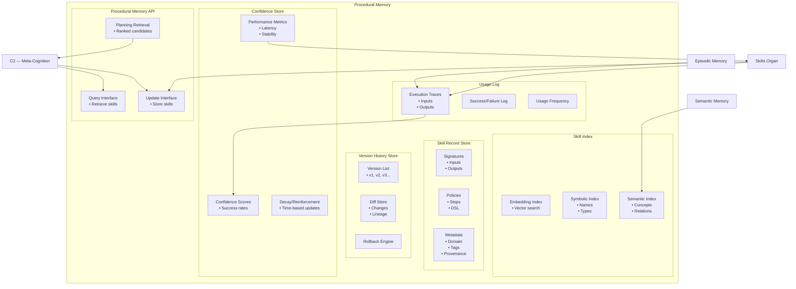

# Procedural Memory — Zoomed‑In Subsystem Poster

This poster zooms into **Procedural Memory**, the subsystem responsible for storing and managing learned skills inside the Memory Organ.  
Procedural Memory is the long‑term home of skills generated by C2 (Meta‑Cognition + Skill Learning) and refined by the Skills Organ.

It stores:
- Skill signatures  
- Skill policies  
- Version history  
- Confidence scores  
- Usage statistics  
- Performance traces  

Procedural Memory is the backbone of Brain‑24’s ability to reuse, refine, and evolve skills over time.

---

## 1. Procedural Memory Diagram

---

## 2. Responsibilities of Procedural Memory

### **Skill Storage**
- Stores skill signatures and policies  
- Maintains structured skill records  
- Tracks metadata and provenance  

### **Skill Versioning**
- Maintains version history  
- Supports upgrades and rollbacks  
- Tracks lineage and diffs  

### **Skill Confidence Tracking**
- Stores confidence scores  
- Tracks performance metrics  
- Supports refinement and retraining  

### **Skill Retrieval**
- Provides skills to C2 for planning  
- Supports symbolic, semantic, and embedding‑based lookup  
- Ranks skills by relevance and confidence  

### **Skill Usage Logging**
- Records usage frequency  
- Stores success/failure traces  
- Supports consolidation and refinement  

---

## 3. Internal Components of Procedural Memory

### **1. Skill Record Store**
- Persistent storage for skill objects  
- Contains signatures, policies, metadata, examples  

### **2. Version History Store**
- Tracks versions and diffs  
- Maintains lineage and provenance  
- Supports rollback and refinement  

### **3. Confidence Store**
- Stores confidence scores  
- Tracks performance metrics  
- Supports decay and reinforcement  

### **4. Skill Index**
- Embedding‑based retrieval  
- Symbolic and semantic indexing  
- Context‑aware ranking  

### **5. Usage Log**
- Records skill executions  
- Stores success/failure traces  
- Supports consolidation and evaluation  

### **6. Procedural Memory API**
- Query interface for C2  
- Update interface for Skills Organ  
- Retrieval interface for planning  

---

## 4. Procedural Memory Interactions

### **With C2 (Meta‑Cognition + Skill Learning)**
- Receives new skills  
- Provides skills for planning  
- Updates skill versions and confidence  

### **With Skills Organ**
- Stores skill records  
- Retrieves skills for execution  
- Receives performance metrics  

### **With Episodic Memory**
- Receives execution traces  
- Provides traces for skill refinement  
- Supports consolidation  

### **With Semantic Memory**
- Uses semantic knowledge for indexing  
- Supports concept‑aware retrieval  

---

## 5. Purpose of This Poster

This subsystem poster helps you:

- Understand the internal architecture of Procedural Memory  
- Visualise how skills are stored, retrieved, and evolved  
- Support incremental implementation of Ch7  
- Provide a subsystem‑level reference for engineering and testing  

---

## 6. Related Documents

- **Skills Organ Poster** — `brain-24-skills-organ-poster.md`  
- **Memory Organ Poster** — `brain-24-memory-organ-poster.md`  
- **Consolidation Engine Poster** — `brain-24-consolidation-engine-poster.md`  
- **C2 Subsystem Poster** — `brain-24-C2-subsystem-poster.md`  
- **Ch7 Skill Learning** — `docs/brain-24/Ch7/`
