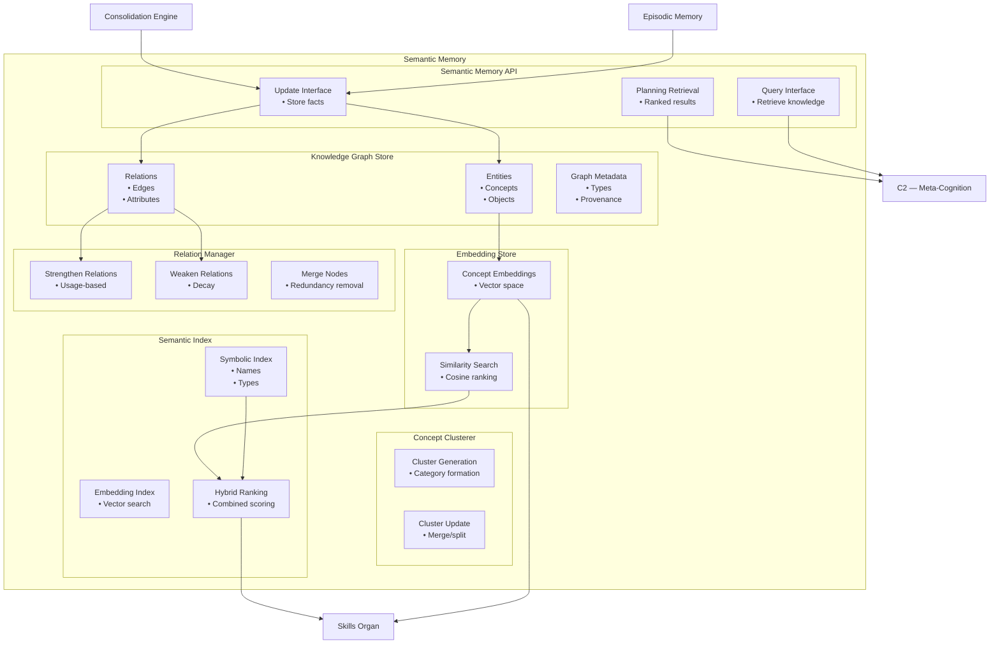

# Semantic Memory — Zoomed‑In Subsystem Poster

This poster zooms into **Semantic Memory**, the subsystem responsible for storing structured knowledge inside the Memory Organ.  
Semantic Memory provides Brain‑24 with stable facts, concepts, relations, embeddings, and conceptual clusters that support reasoning, planning, and skill learning.

Semantic Memory is the backbone of:
- grounding  
- concept understanding  
- fact retrieval  
- semantic similarity  
- knowledge‑based planning  
- skill indexing and generalization  

---

## 1. Semantic Memory Diagram

---

## 2. Responsibilities of Semantic Memory

### **Knowledge Storage**
- Stores facts, concepts, and relations  
- Maintains a structured knowledge graph  
- Supports symbolic and semantic queries  

### **Embedding Space**
- Stores vector embeddings for concepts  
- Supports similarity search  
- Enables semantic clustering and generalization  

### **Concept Clustering**
- Groups related concepts  
- Maintains category structures  
- Supports abstraction and reasoning  

### **Knowledge Updating**
- Integrates new facts from consolidation  
- Merges redundant or overlapping concepts  
- Strengthens or weakens relations based on usage  

### **Semantic Retrieval**
- Provides knowledge to C2 during planning  
- Supports concept‑aware skill retrieval  
- Enables hybrid symbolic + embedding search  

---

## 3. Internal Components of Semantic Memory

### **1. Knowledge Graph Store**
- Stores entities, relations, attributes  
- Maintains graph structure and metadata  
- Supports symbolic queries  

### **2. Embedding Store**
- Stores vector embeddings for concepts  
- Supports similarity search  
- Enables semantic ranking  

### **3. Concept Clusterer**
- Groups related concepts  
- Maintains category hierarchies  
- Supports abstraction and generalization  

### **4. Relation Manager**
- Manages edges in the knowledge graph  
- Strengthens or weakens relations  
- Merges or splits nodes  

### **5. Semantic Index**
- Hybrid index combining symbolic and embedding search  
- Supports fast retrieval  
- Provides ranked results  

### **6. Semantic Memory API**
- Query interface for C2 and Skills  
- Update interface for Consolidation  
- Retrieval interface for planning and reasoning  

---

## 4. Semantic Memory Interactions

### **With C2 (Meta‑Cognition + Skill Learning)**
- Provides semantic knowledge for planning  
- Supports skill generalization  
- Supplies concept embeddings  

### **With Skills Organ**
- Supports semantic skill retrieval  
- Provides concept‑aware ranking  
- Supplies embeddings for indexing  

### **With Consolidation Engine**
- Receives extracted facts  
- Updates concept clusters  
- Strengthens or weakens relations  

### **With Episodic Memory**
- Receives extracted knowledge  
- Supports semantic grounding of traces  

---

## 5. Purpose of This Poster

This subsystem poster helps you:

- Understand the internal architecture of Semantic Memory  
- Visualise how knowledge is stored, updated, and retrieved  
- Support incremental implementation of the Memory Organ  
- Provide a subsystem‑level reference for engineering and testing  

---

## 6. Related Documents

- **Memory Organ Poster** — `brain-24-memory-organ-poster.md`  
- **Procedural Memory Poster** — `brain-24-procedural-memory-poster.md`  
- **Consolidation Engine Poster** — `brain-24-consolidation-engine-poster.md`  
- **C2 Subsystem Poster** — `brain-24-C2-subsystem-poster.md`  
- **Ch7 Skill Learning** — `docs/brain-24/Ch7/`
