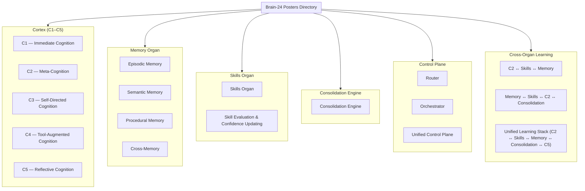

# Brain‑24 Posters Directory  
Master Index of All Architecture Posters (18 Total)

This directory contains the complete set of zoomed‑in, cross‑organ, and control‑plane posters for the Brain‑24 architecture.  
Each poster is a standalone subsystem reference, and together they form the full documentation of the Brain‑24 cognitive and learning stack.

---

## 1. Directory Structure

---

## 2. Poster Groups

### **Cortex (C1–C5)**
- C1 — Immediate Cognition  
- C2 — Meta‑Cognition + Skill Learning  
- C3 — Self‑Directed Cognition  
- C4 — Tool‑Augmented Cognition  
- C5 — Reflective Cognition  

### **Memory Organ**
- Episodic Memory  
- Semantic Memory  
- Procedural Memory  
- Cross‑Memory  

### **Skills Organ**
- Skills Organ  
- Skill Evaluation & Confidence Updating  

### **Consolidation**
- Consolidation Engine  

### **Control Plane**
- Router  
- Orchestrator  
- Unified Control Plane  

### **Cross‑Organ Learning**
- C2 ↔ Skills ↔ Memory  
- Memory ↔ Skills ↔ C2 ↔ Consolidation  
- Unified Learning Stack (C2 ↔ Skills ↔ Memory ↔ Consolidation ↔ C5)
