# Skill Evaluation & Confidence Updating — Zoomed‑In Subsystem Poster

This poster zooms into the **Skill Evaluation & Confidence Updating subsystem**, the component responsible for monitoring skill performance, updating confidence scores, and triggering refinement or retraining.  
It sits at the intersection of the Skills Organ, Procedural Memory, and C2 (Meta‑Cognition + Skill Learning).

This subsystem ensures that Brain‑24:
- Trusts skills that work well  
- Detects skills that degrade  
- Updates confidence scores over time  
- Flags skills for refinement or retraining  
- Maintains a healthy, reliable skill library  

---

## 1. Skill Evaluation Diagram

```mermaid
flowchart TB

    %% ============================
    %% SKILL EVALUATION SUBSYSTEM
    %% ============================
    subgraph SkillEval["Skill Evaluation & Confidence Updating"]

        %% Performance Monitoring
        subgraph PerfMonitor["Performance Monitor"]
            SuccessFail["Success/Failure Tracking"]
            Latency["Latency & Stability Metrics"]
            TraceCollector["Execution Trace Collector"]
        end

        %% Confidence Updating
        subgraph ConfidenceCalc["Confidence Calculator"]
            Reinforce["Reinforcement\n• Success-based boosts"]
            Decay["Decay\n• Time-based reduction"]
            Normalize["Normalization\n• Cross-skill balancing"]
        end

        %% Drift Detection
        subgraph DriftDetect["Drift Detector"]
            BehaviorCompare["Behavior Comparison\n• Output consistency"]
            PatternShift["Pattern Shift Detection"]
            DegradationFlag["Degradation Flag"]
        end

        %% Refinement Trigger
        subgraph Refinement["Refinement Trigger"]
            TriggerC2["Trigger C2\n• Regenerate skill"]
            SendToConsolidation["Send to Consolidation\n• Retraining"]
            VersionDecision["Version Decision\n• Upgrade or rollback"]
        end

        %% API Layer
        subgraph API["Evaluation API"]
            EvalReport["Evaluation Report\n• Summary for C2"]
            UpdateProcedural["Update Procedural Memory\n• Scores & metrics"]
        end

    end

    %% ============================
    %% EXTERNAL SYSTEMS
    %% ============================
    Skills["Skills Organ"]
    Procedural["Procedural Memory"]
    C2["C2 — Meta‑Cognition"]
    Consolidation["Consolidation Engine"]

    %% ============================
    %% INTERACTIONS
    %% ============================

    %% Skills → Evaluation
    Skills --> TraceCollector
    Skills --> SuccessFail
    Skills --> Latency

    %% Evaluation → Procedural Memory
    Reinforce --> UpdateProcedural
    Decay --> UpdateProcedural
    Normalize --> UpdateProcedural
    DegradationFlag --> UpdateProcedural

    %% Evaluation → C2
    EvalReport --> C2
    TriggerC2 --> C2

    %% Evaluation → Consolidation
    SendToConsolidation --> Consolidation

    %% Procedural Memory → Evaluation
    Procedural --> BehaviorCompare
    Procedural --> PatternShift
```

---

## 2. Responsibilities of Skill Evaluation

### **Performance Monitoring**
- Tracks success/failure rates  
- Measures latency and stability  
- Monitors tool‑based steps inside skills  

### **Confidence Updating**
- Adjusts confidence scores based on performance  
- Applies decay for unused skills  
- Reinforces frequently successful skills  

### **Skill Quality Assessment**
- Detects degradation or drift  
- Identifies inconsistent outputs  
- Flags skills for refinement  

### **Refinement Triggering**
- Signals C2 to regenerate or update a skill  
- Sends degraded skills to the Consolidation Engine  
- Supports version upgrades  

### **Usage‑Aware Scoring**
- Incorporates usage frequency  
- Tracks context‑specific performance  
- Supports domain‑aware confidence weighting  

---

## 3. Internal Components of Skill Evaluation

### **1. Performance Monitor**
- Collects execution traces  
- Measures success/failure  
- Tracks latency and stability  

### **2. Confidence Calculator**
- Computes updated confidence scores  
- Applies reinforcement or decay  
- Normalizes scores across skills  

### **3. Drift Detector**
- Detects changes in skill behavior  
- Identifies inconsistent outputs  
- Flags potential degradation  

### **4. Refinement Trigger**
- Signals C2 for skill regeneration  
- Sends degraded skills to Consolidation  
- Supports versioning decisions  

### **5. Evaluation API**
- Provides evaluation results to C2  
- Updates Procedural Memory  
- Integrates with the Skills Organ  

---

## 4. Interactions

### **With Skills Organ**
- Receives execution results  
- Updates skill confidence  
- Flags skills for refinement  
- Supports version upgrades  

### **With Procedural Memory**
- Writes updated confidence scores  
- Stores performance metrics  
- Logs usage statistics  

### **With C2 (Meta‑Cognition + Skill Learning)**
- Sends refinement triggers  
- Provides evaluation summaries  
- Supports skill regeneration  

### **With Consolidation Engine**
- Sends degraded skills for retraining  
- Receives updated skill versions  

---

## 5. Purpose of This Poster

This subsystem poster helps you:

- Understand how Brain‑24 evaluates and maintains skill quality  
- Visualise the confidence updating and refinement loop  
- Support incremental implementation of Ch7  
- Provide a subsystem‑level reference for engineering and testing  

---

## 6. Related Documents

- **Skills Organ Poster** — `brain-24-skills-organ-poster.md`  
- **Procedural Memory Poster** — `brain-24-procedural-memory-poster.md`  
- **Consolidation Engine Poster** — `brain-24-consolidation-engine-poster.md`  
- **C2 Subsystem Poster** — `brain-24-C2-subsystem-poster.md`  
- **Ch7 Skill Learning** — `docs/brain-24/Ch7/`
