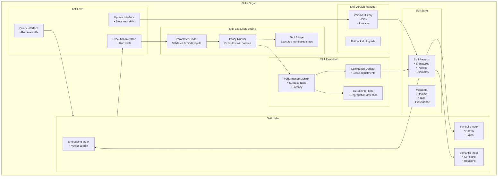

# Skills Organ — Zoomed‑In Subsystem Poster

This poster zooms into the **Skills Organ**, the subsystem responsible for storing, retrieving, and managing learned skills in Brain‑24.  
It works closely with C2 (Meta‑Cognition + Skill Learning), Memory, and the Control Plane to provide reusable, parameterized capabilities that accelerate planning and execution.

---

## 1. Skills Organ Diagram

---

## 2. Skills Organ Responsibilities

### **Skill Storage**
- Stores learned skills from C2 (Ch7)  
- Maintains skill signatures and policies  
- Tracks versions and confidence scores  
- Organizes skills by domain and type  

### **Skill Retrieval**
- Provides skills to C2 during planning  
- Supports semantic, symbolic, and embedding‑based lookup  
- Selects best skill based on context and confidence  

### **Skill Execution Interface**
- Provides a uniform interface for executing skills  
- Handles parameter binding and validation  
- Returns structured outputs to C2 or C3  

### **Skill Versioning**
- Maintains version history  
- Supports rollback and refinement  
- Tracks performance metrics over time  

### **Skill Evaluation**
- Monitors skill performance  
- Updates confidence scores  
- Flags skills for retraining or consolidation  

---

## 3. Internal Components of the Skills Organ

### **1. Skill Store**
- Persistent storage of skill records  
- Contains signatures, policies, examples, metadata  

### **2. Skill Index**
- Embedding‑based retrieval  
- Symbolic and semantic indexing  
- Context‑aware ranking  

### **3. Skill Execution Engine**
- Executes skill policies  
- Handles multi‑step or atomic skills  
- Integrates with C4 for tool‑based steps  

### **4. Skill Version Manager**
- Tracks versions and diffs  
- Supports upgrades and rollbacks  
- Maintains lineage and provenance  

### **5. Skill Evaluator**
- Scores skill performance  
- Detects degradation  
- Triggers retraining or refinement  

### **6. Skills API**
- Query interface for C2  
- Execution interface for C3  
- Update interface for Skill Learner (Ch7)  

---

## 4. Skills Organ Interactions

### **With C2 (Meta‑Cognition + Skill Learning)**
- Receives new skills  
- Provides skills for planning  
- Updates skill versions  

### **With Memory**
- Stores procedural skill records  
- Retrieves episodic traces for evaluation  
- Uses semantic knowledge for indexing  

### **With C3 (Self‑Directed Cognition)**
- Executes skills for autonomous tasks  
- Provides skill capabilities for long‑horizon goals  

### **With C4 (Tool‑Augmented Cognition)**
- Executes tool‑based steps inside skills  
- Retrieves tool capabilities for skill policies  

---

## 5. Purpose of This Poster

This subsystem poster helps you:

- Understand the internal architecture of the Skills Organ  
- Visualise how skills are stored, retrieved, executed, and evolved  
- Support incremental implementation of Ch7 skill learning  
- Provide a subsystem‑level reference for engineering and testing  

---

## 6. Related Documents

- **Ch7 Skill Learning** — `docs/brain-24/Ch7/`  
- **Memory Organ Poster** — `brain-24-memory-organ-poster.md`  
- **C2 Subsystem Poster** — `brain-24-C2-subsystem-poster.md`  
- **Full Brain‑24 Poster** — `04-poster/brain-24-single-page-poster.md`
