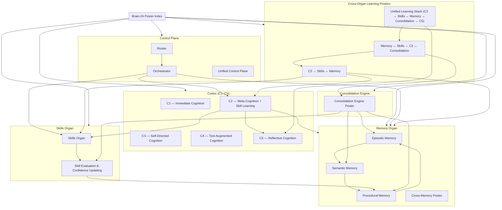

# Brain‑24 Master Index Poster  
(Visual Map of All 18 Posters)

This master index shows the full poster set for the Brain‑24 architecture.  
It organizes all 18 posters into five major groups:

- **Cortex (C1–C5)**  
- **Memory Organ (Episodic, Semantic, Procedural, Cross‑Memory)**  
- **Skills Organ (Skills + Skill Evaluation)**  
- **Consolidation Engine**  
- **Control Plane (Router + Orchestrator + Unified)**  
- **Cross‑Organ Posters (Learning Loop)**  

This index is the top‑level map for navigating the entire documentation set.

---

## 1. Master Index Diagram

---

## 2. Poster Groups

### **A. Cortex Posters**
1. C1 — Immediate Cognition  
2. C2 — Meta‑Cognition + Skill Learning  
3. C3 — Self‑Directed Cognition  
4. C4 — Tool‑Augmented Cognition  
5. C5 — Reflective Cognition  

---

### **B. Memory Organ Posters**
6. Episodic Memory  
7. Semantic Memory  
8. Procedural Memory  
9. Cross‑Memory (Episodic ↔ Semantic ↔ Procedural)  

---

### **C. Skills Organ Posters**
10. Skills Organ  
11. Skill Evaluation & Confidence Updating  

---

### **D. Consolidation Posters**
12. Consolidation Engine  

---

### **E. Control Plane Posters**
13. Router  
14. Orchestrator  
15. Unified Control Plane (Router + Orchestrator)  

---

### **F. Cross‑Organ Learning Posters**
16. C2 ↔ Skills ↔ Memory  
17. Memory ↔ Skills ↔ C2 ↔ Consolidation  
18. Unified Learning Stack (C2 ↔ Skills ↔ Memory ↔ Consolidation ↔ C5)  

---

## 3. Purpose of This Poster

This master index helps you:

- Navigate the entire Brain‑24 poster library  
- Understand how each subsystem fits into the architecture  
- Maintain a clean, scalable documentation structure  
- Quickly locate any zoomed‑in or cross‑organ poster  

---

## 4. Related Documents

- `brain-24-learning-stack-unified-poster.md`  
- `brain-24-cross-memory-poster.md`  
- `brain-24-consolidation-engine-poster.md`  
- `brain-24-C2-subsystem-poster.md`  
- `brain-24-C5-reflective-cognition-poster.md`  
