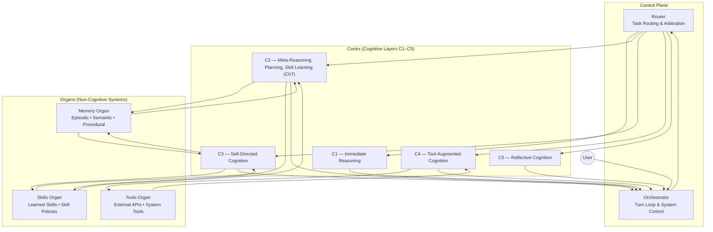

# Brain‑24 Full Poster

This poster unifies all subsystems of the Brain‑24 architecture on a single page.  
It shows the cognitive layers (C1–C5), organs (Memory, Skills, Tools), and control plane (Router, Orchestrator).

---

## 1. Poster Diagram

---

## 2. Poster Overview

The Brain‑24 poster integrates three architectural views:

### **1. Cognitive Layers (Cortex)**
The five layers of cognition:
- **C1 — Immediate reasoning**
- **C2 — Meta‑reasoning, planning, skill learning (Ch7)**
- **C3 — Self‑directed cognition**
- **C4 — Tool‑augmented cognition**
- **C5 — Reflective cognition**

### **2. Organs (Non‑Cognitive Systems)**
Separate from the Cortex:
- **Memory** — episodic, semantic, procedural  
- **Skills** — learned skills, skill policies  
- **Tools** — external APIs, system tools  

### **3. Control Plane**
Coordinates cognition and organs:
- **Router** — task routing and arbitration  
- **Orchestrator** — turn loop and system control  

---

## 3. Purpose

This poster provides a unified view of Brain‑24:
- Shows how cognition (C1–C5) interacts with organs and control systems  
- Serves as the canonical reference for architecture discussions  
- Acts as the “front page” of the Brain‑24 documentation set  

---

## 4. Related Documents

- **Overview** — `00-overview/brain-24-overview.md`  
- **Director Tree** — `00-overview/brain-24-director-tree.md`  
- **Core Loop** — `01-runtime/brain-24-core-loop.md`  
- **Component Map** — `02-architecture/brain-24-component-map.md`  
- **Deployment Diagram** — `02-architecture/brain-24-deployment-diagram.md`  
- **Type System** — `03-types/brain-24-type-system.md`  
- **Skill Learning (Ch7)** — `docs/brain-24/Ch7/`  
- **Architecture Evolution** — `brain-24-architecture-evolution-A0-A4.md`
