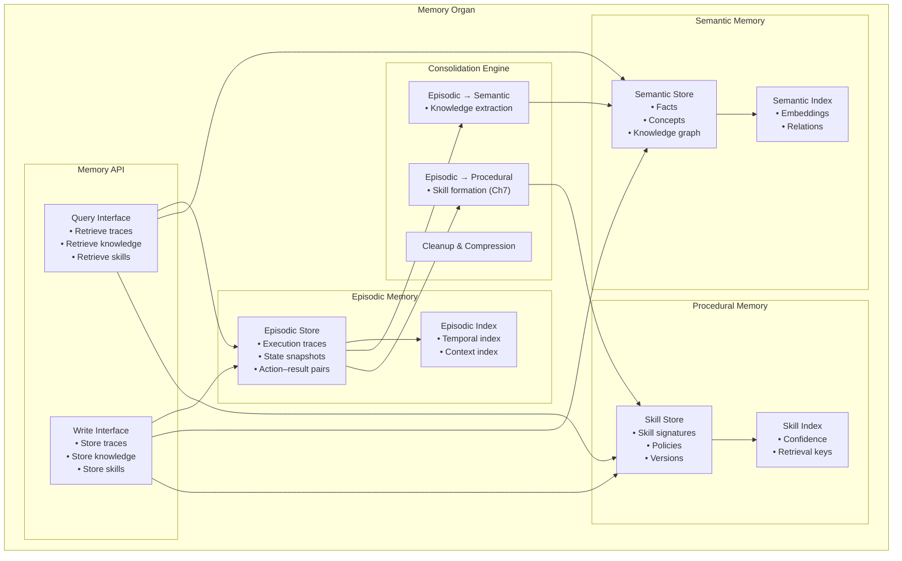

# Memory Organ — Zoomed‑In Subsystem Poster

This poster zooms into the **Memory Organ** of Brain‑24.  
Memory is a non‑cognitive organ responsible for storing, retrieving, and consolidating knowledge, experiences, and learned skills.  
It supports the Cortex (C1–C5) and the Skills Organ by providing structured, queryable, long‑term storage.

---

## 1. Memory Organ Diagram

---

## 2. Memory Responsibilities

### **Episodic Memory**
- Stores execution traces  
- Records user interactions  
- Captures context, state, and outcomes  
- Supports reflection and debugging  

### **Semantic Memory**
- Stores stable knowledge  
- Maintains facts, concepts, definitions  
- Provides grounding for reasoning  
- Supports C1 and C2 during planning  

### **Procedural Memory**
- Stores learned skills (Ch7)  
- Maintains skill signatures and policies  
- Tracks versions and confidence scores  
- Supports skill retrieval and reuse  

---

## 3. Memory Internal Components

### **1. Episodic Store**
- Time‑indexed traces  
- State snapshots  
- Action–result pairs  
- Retrieval by similarity or context  

### **2. Semantic Store**
- Fact graph  
- Concept embeddings  
- Knowledge clusters  
- Retrieval by meaning or relation  

### **3. Procedural Store**
- Skill records  
- Skill policies  
- Version history  
- Confidence metrics  

### **4. Indexing Layer**
- Embedding‑based indexing  
- Temporal indexing  
- Symbolic indexing  
- Hybrid retrieval strategies  

### **5. Consolidation Engine**
- Converts episodic traces into semantic knowledge  
- Converts repeated plans into procedural skills  
- Performs cleanup and compression  
- Maintains memory health  

### **6. Memory API**
- Query interface for Cortex  
- Write interface for Skills Organ  
- Retrieval interface for C2 planning  
- Update interface for consolidation  

---

## 4. Memory Interactions

### **With C2 (Meta‑Cognition)**
- Reads episodic traces for planning  
- Writes procedural skills (Ch7)  
- Retrieves semantic knowledge for reasoning  

### **With C3 (Self‑Directed Cognition)**
- Stores long‑horizon goals  
- Retrieves background task context  

### **With Skills Organ**
- Stores learned skills  
- Retrieves skills for execution  
- Updates skill versions  

### **With C5 (Reflective Cognition)**
- Provides episodic traces for reflection  
- Receives corrections and updates  

---

## 5. Purpose of This Poster

This subsystem poster helps you:

- Understand the internal architecture of the Memory Organ  
- Visualise how episodic, semantic, and procedural memory interact  
- Support incremental implementation of Ch7 skill learning  
- Provide a subsystem‑level reference for engineering and testing  

---

## 6. Related Documents

- **Ch7 Skill Learning** — `docs/brain-24/Ch7/`  
- **Memory Type System** — `brain-24-memory-type-system.md`  
- **Memory Director** — `brain-24-memory-director.md`  
- **Full Brain‑24 Poster** — `04-poster/brain-24-single-page-poster.md`
