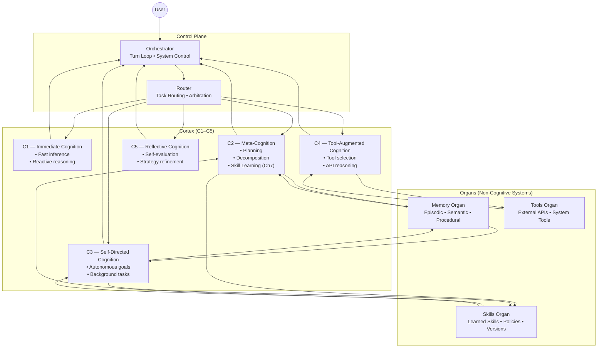

# Brain‑24 Zoomed‑In Subsystem Poster

This poster provides a subsystem‑level view of Brain‑24, showing the internal structure of the Cortex (C1–C5), the Organs (Memory, Skills, Tools), and the Control Plane (Router, Orchestrator).  
It is designed to complement the full Brain‑24 poster by revealing the internal responsibilities and data flows of each subsystem.

---

## 1. Zoomed‑In Diagram

---

## 2. Subsystem Responsibilities

### **Cortex (C1–C5)**  
The cognitive engine of Brain‑24:

- **C1 — Immediate Cognition**  
  Fast, reactive reasoning; single‑step inference.

- **C2 — Meta‑Cognition**  
  Planning, decomposition, skill learning (Ch7), evaluation.

- **C3 — Self‑Directed Cognition**  
  Autonomous goal pursuit, background tasks, self‑initiated actions.

- **C4 — Tool‑Augmented Cognition**  
  Tool selection, tool orchestration, API reasoning.

- **C5 — Reflective Cognition**  
  Self‑evaluation, error correction, strategy refinement.

---

### **Organs (Non‑Cognitive Systems)**  
These provide capability, not cognition:

- **Memory Organ**  
  Episodic traces, semantic knowledge, procedural skills, retrieval.

- **Skills Organ**  
  Learned skills, skill policies, versioning, confidence scoring.

- **Tools Organ**  
  External APIs, system tools, environment interfaces.

---

### **Control Plane**  
Coordinates everything:

- **Router**  
  Arbitration, routing between Cortex and Organs, dispatch logic.

- **Orchestrator**  
  Turn loop, system control, lifecycle management.

---

## 3. Purpose of This Poster

This zoomed‑in view helps you:

- Understand subsystem boundaries  
- See how cognition interacts with capability organs  
- Visualise the internal flow of data and control  
- Support incremental implementation and testing  
- Provide a subsystem‑level reference for engineering work

---

## 4. Related Documents

- **Full Brain‑24 Poster** — `04-poster/brain-24-single-page-poster.md`  
- **Ch7 Skill Learning** — `docs/brain-24/Ch7/`  
- **Component Map** — `02-architecture/brain-24-component-map.md`  
- **Core Loop** — `01-runtime/brain-24-core-loop.md`
