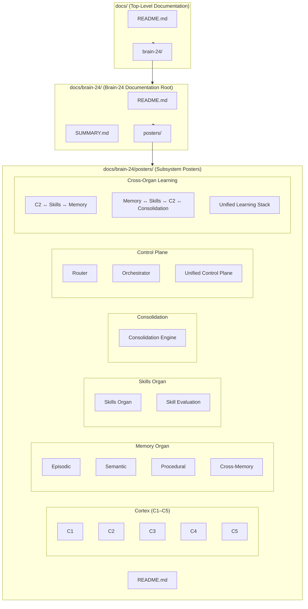

# Brain‑24 Documentation Map  
Visual Overview of `docs/` → `docs/brain-24/` → Posters

This poster shows how the documentation system is structured.  
It maps the relationship between:

- the **top‑level docs directory**
- the **Brain‑24 documentation root**
- the **posters subsystem**
- the **18 subsystem posters**

This is the “documentation architecture diagram” for the entire repo.

---

## 1. Docs Map Diagram

---

## 2. Directory Overview

### **Top‑Level Docs Directory (`docs/`)**
Contains:
- `README.md` — overview of all documentation  
- `brain-24/` — full Brain‑24 architecture docs  

### **Brain‑24 Documentation Root (`docs/brain-24/`)**
Contains:
- `README.md` — overview of Brain‑24 docs  
- `SUMMARY.md` — table of contents  
- `posters/` — all subsystem posters (18 total)  

### **Posters Directory (`docs/brain-24/posters/`)**
Contains:
- `README.md` — poster index  
- 6 major groups of posters  
- 18 total subsystem posters  

---

## 3. Poster Groups

### **Cortex (C1–C5)**
Immediate → Meta → Self‑Directed → Tool‑Augmented → Reflective Cognition

### **Memory Organ**
Episodic → Semantic → Procedural → Cross‑Memory

### **Skills Organ**
Skills Organ → Skill Evaluation

### **Consolidation**
Consolidation Engine

### **Control Plane**
Router → Orchestrator → Unified Control Plane

### **Cross‑Organ Learning**
C2 ↔ Skills ↔ Memory  
Memory ↔ Skills ↔ C2 ↔ Consolidation  
Unified Learning Stack

---

## 4. Purpose of This Poster

This Docs Map helps you:

- Understand how documentation is organized  
- Navigate between high‑level docs and subsystem posters  
- Maintain a clean, scalable documentation structure  
- Onboard new contributors quickly  

---

## 5. Related Files

- `docs/README.md`  
- `docs/brain-24/README.md`  
- `docs/brain-24/SUMMARY.md`  
- `docs/brain-24/posters/README.md`  
